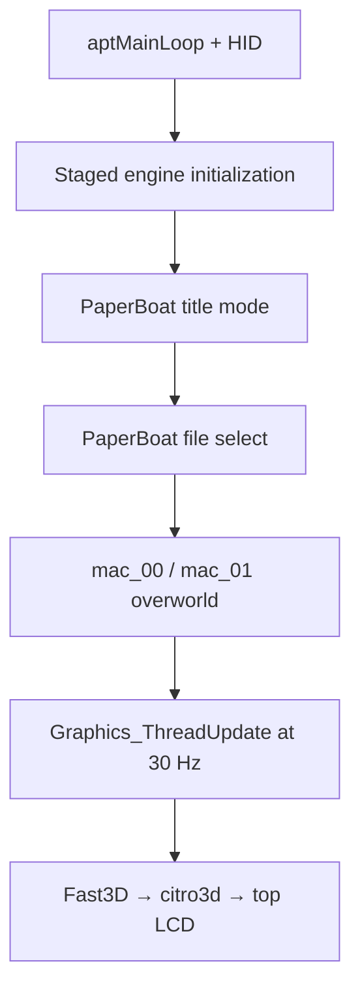

# M13 — Full PaperBoat Runtime + Renderer Integration

**Goal:** a playtestable Homebrew Launcher build that runs PaperBoat's real
title → file select → first Toad Town overworld path inside one responsive 3DS
APT loop.

## Acceptance status

The software implementation is a **playtest candidate**. The normal CI target
links the selected 386-source PaperBoat 1.0.1 closure and the application enters
that runtime whenever the pinned game archive passes device-side preflight.
There is no `PB3DS_GAME_OBJECTS`, `M13_LINK_GAME`, or
`PB3DS_GAME_RUNTIME_READY` compile-time escape hatch.

This document does not claim an emulator or New 3DS XL result. M13 becomes
accepted only after the hardware checklist below demonstrates the complete
path and the returned `PaperBoat3DS.log` has no runtime, resource, or renderer
failure.

## Runtime path



`boot_main`, `step_game_loop`, `gfx_draw_frame`, player, camera, file-menu,
and map symbols are all required in the final ELF. `boot_main` is not invoked:
the upstream entry owns an infinite NuSystem graphics loop and would starve
APT/HOME handling. `pb_runtime_begin_game` instead reproduces the ordered
`load_engine_data` sequence one stage per APT iteration, then activates
`GAME_MODE_TITLE_SCREEN`. A reachable startup/soft-reset mode re-enters that
same staged sequence rather than recursively calling `boot_main`.

The bounded M13 world registry contains `mac_00` and `mac_01`. A confirmed
file slot is deliberately routed to fresh-file Toad Town; exits into unlinked
chapter maps are not bound. Requests for battle or another unlinked mode fail
with an explicit diagnostic.

## Resources and sprites

The runtime consumes the pinned Torch-LH OTR envelopes in `pm64.o2r`:

- `OBLB`, `OVTX`, `OTEX`, `ODLT`, `OMTX`, `OVPT`, Torch lights, and
  `VC3S`;
- both supported envelope byte orders, with host-native vertex, matrix, and
  vector conversion;
- RGBA32, RGBA16, CI4, CI8, I4, I8, IA4, IA8, and IA16 textures;
- indexed ZIP lookup, STORE/DEFLATE extraction, CRC32 verification, and exact
  Torch/libultraship CRC64 name lookup;
- stable, resource-owned `__OTR__` names and payloads retained until the GPU
  cache has been invalidated during shutdown.

Asset preparation rejects unsafe names, duplicates, CRC64 collisions,
unsupported types or compression, malformed dimensions/counts, truncated
multi-packet GBI commands, missing terminal `G_ENDDL`, wrong PaperBoat
versions, and incomplete title/file-menu/map resource sets.

The sprite bridge converts 32-bit-offset sprite blobs to native pointer-sized
structures. It validates every animation/component range, command stream,
raster, palette, companion texture type, and companion dimensions during the
size pass. Player world sheets and the exact fresh-file `mac_00` NPC sheets are
decoded before title activation. A missing split companion is accepted only
when the pinned sprite blob contains the complete authentic raster or palette;
otherwise startup fails. No path fabricates replacement pixels.

Before title activation, the two accepted shape trees are walked recursively.
Every referenced shape display list, nested/hash display list, vertex, matrix,
viewport, light, texture, and required CI palette must decode with the expected
type. Map texture metadata additionally validates main, auxiliary, palette, and
mipmap resources before generating a bounded Gfx list. Map transitions and
soft resets invalidate the GPU cache, free only owned texture command lists,
and clear stale handles before loading the next tree.

## Fast3D and PICA200

The renderer handles the ordinary, filepath, hash, and wide forms exercised by
the accepted path for vertices, display lists, matrices, lights/movemem,
texture images, triangles, rectangles, and framebuffer operations. It also
implements:

- model-view/projection stacks, N64 viewport, source-space scissor, and the
  320×240 image centered with 40-pixel pillars on the 400×240 top screen;
- CI TLUT selection and palette invalidation, wrap/mirror/clamp/mask/shift,
  texture rectangles, wide rectangles, image rectangles, and copy-cycle
  edge rules;
- depth target clears, depth compare/write, primitive depth, alpha coverage,
  transparency, fog, and PICA texture lifetime across submitted frames;
- one- and two-cycle combiner semantics mapped to TEV, with an instrumented
  legacy fallback where exact PICA expression is unavailable;
- runtime framebuffer create/register/set/reset/copy/read services used by
  pause and screen effects.

Missing OTR references, malformed lists, fallback textures, unsupported
observable custom commands, framebuffer errors, or command-budget overflow
fail the frame and close the runtime. Synchronization commands and the
canonical NOP are safe no-ops because PICA submission is synchronous.

## Platform services

- Native HID populates upstream `OSContPad`; SELECT is withheld for M16.
- `osGetCount` converts the fixed ARM11 system tick to the N64 46.875 MHz
  counter, while the outer scheduler uses an exact 33/33/34 ms cadence.
- HOME/sleep suspends input and graphics without catch-up update bursts.
- Flash reads, page writes, and sector erases are bounded and persistent.
- File-menu and pause overlays are verified as resident linked code.
- Event calls are no-ops only while all listener IDs remain `-1`; registering
  an event without a dispatcher is fatal.
- Rumble reports hardware absent. Audio state is typed but silent by design;
  audio output is outside M13 gameplay acceptance.

## Build and host verification

The authoritative workflow runs the host contracts, cross-compiles the full
closure with the pinned devkitARM container, verifies final runtime symbols and
heap alignment, checks the memory budget, and publishes `.3dsx`, `.3ds`, and
`.cia` packages. See [BUILDING.md](BUILDING.md) for exact commands and legal
asset preparation.

The focused M13 checks are:

```sh
python3 tests/test_m13_runtime_generation.py \
  tools/generate_m13_runtime.py .cache/upstream/PaperBoat
sh tools/test_runtime_startup.sh
sh tools/test_runtime_flash.sh
sh tools/test_runtime_resources.sh
sh tools/test_gfx_api_contract.sh
sh tools/test_world_boot.sh
sh tools/test_world_scene.sh
```

They include valid and malformed resource envelopes (including `OVPT`),
missing/mismatched sprite companions, recursive shape/display-list closure,
missing and wrong-type CRC64 references, OTR filepath/hash resolution,
multi-packet display lists, map-texture ownership, framebuffer operations,
rejected unsupported commands, save bounds, exact startup order, soft-reset
re-entry, pacing, and shutdown lifetime.

## New 3DS XL acceptance checklist

1. Prepare and stage the two legal archives and manifest with the commands in
   [BUILDING.md](BUILDING.md). Copy the CI `.3dsx` into the same
   `/3ds/PaperBoat3DS/` directory.
2. Cold boot from Homebrew Launcher. Confirm the real Paper Mario title art is
   visible and animated—not the checker/sail diagnostic—and wait at least
   30 seconds without a freeze.
3. Press A or START. Confirm the real file-select UI is visible, move between
   slots, return to title with B, and repeat that transition three times.
4. Select a fresh slot. Confirm `mac_00` appears with Mario, Luigi/Toads/Dojo
   NPCs, map geometry, background, and transparent sprites visible.
5. Walk and move the camera through `mac_00`, cross to `mac_01` and back, open
   and close pause, and continue updating for at least five minutes.
6. Exit with L+R+START. Relaunch, confirm the saved slot remains readable, and
   verify HOME suspend/resume once.
7. Return `/3ds/PaperBoat3DS/PaperBoat3DS.log`, the exact build SHA shown on
   the bottom screen, and any photo/video or precise first failing step.

Hardware-only checks still pending until those results are supplied: LCD
orientation/color, sustained frame pacing, HOME behavior, physical controls,
SD latency, and long-session memory stability.
